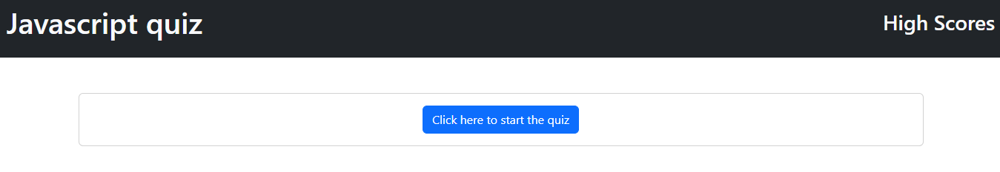

# Dan O'Neil's Javascript Quiz

## Javascript Quiz
This project is a quiz of multiple choice questions that scores you based on the time it takes you to answer and the number of correct answers you submitted. It uses boostrap for CSS and Javascript tracks the score for each question and stores your 5 best scores in your browser's local storage. 

## Installation
This project runs in a browser and requires no installation beyond a functional web browser.
Here is a screenshot of the website and a link to the fully functional website
[Javascript Quiz](https://danpatoneil.github.io/Javascript-Quiz/)

## Use
This application will help you hone your Javascript knowledge, at least for these five questions, and the high score system will provide a fun challenge for learners that would like to try and shoot for the highest score possible (the highest score possible is 1000).

## Future iterations
In future iterations and updates to this project I would like to try and instead of using a few pre-baked questions to choose instead from a list of questions. It would also be a good update to the system to randomize the positions of the four answers so players couldn't simply remember which of the answers went where when going for time results and ignore the actual questions. I would also in future iterations reconfigure the test such that the button to start the test reappears and perhaps even makes sure to pull a different set of questions for re-tries.

MIT License

Copyright (c) 2024 Daniel O'Neil

Permission is hereby granted, free of charge, to any person obtaining a copy
of this software and associated documentation files (the "Software"), to deal
in the Software without restriction, including without limitation the rights
to use, copy, modify, merge, publish, distribute, sublicense, and/or sell
copies of the Software, and to permit persons to whom the Software is
furnished to do so, subject to the following conditions:

The above copyright notice and this permission notice shall be included in all
copies or substantial portions of the Software.

THE SOFTWARE IS PROVIDED "AS IS", WITHOUT WARRANTY OF ANY KIND, EXPRESS OR
IMPLIED, INCLUDING BUT NOT LIMITED TO THE WARRANTIES OF MERCHANTABILITY,
FITNESS FOR A PARTICULAR PURPOSE AND NONINFRINGEMENT. IN NO EVENT SHALL THE
AUTHORS OR COPYRIGHT HOLDERS BE LIABLE FOR ANY CLAIM, DAMAGES OR OTHER
LIABILITY, WHETHER IN AN ACTION OF CONTRACT, TORT OR OTHERWISE, ARISING FROM,
OUT OF OR IN CONNECTION WITH THE SOFTWARE OR THE USE OR OTHER DEALINGS IN THE
SOFTWARE.
